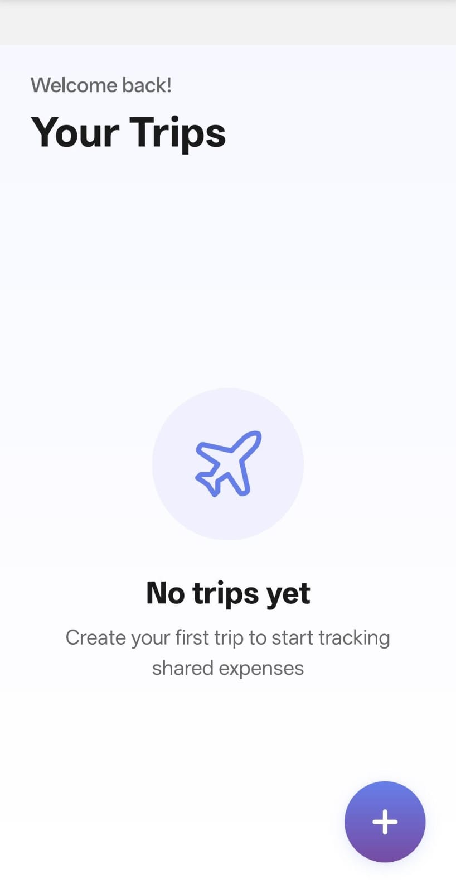
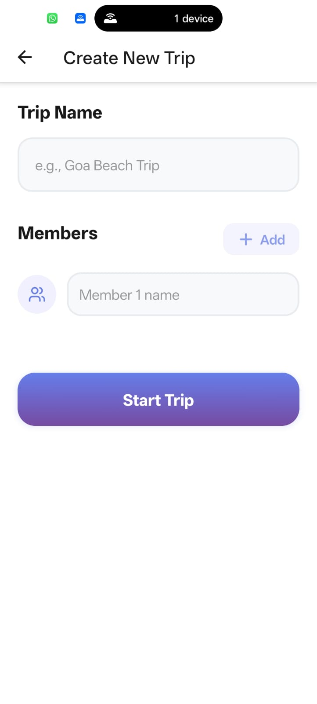
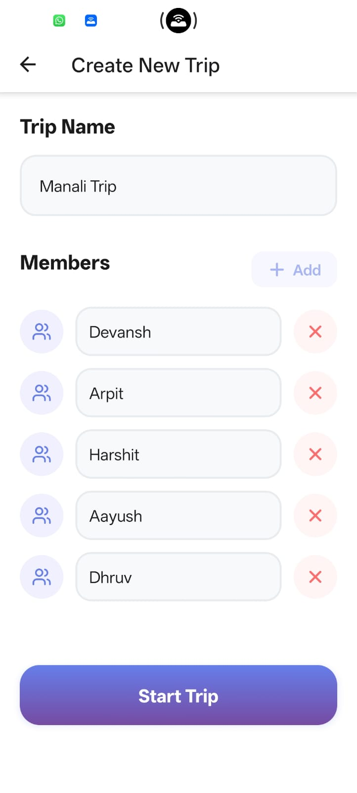
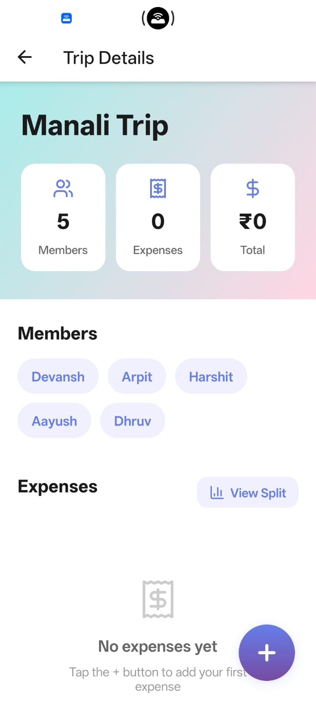
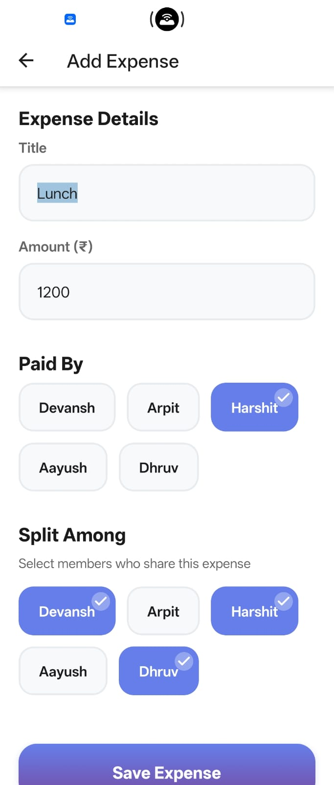
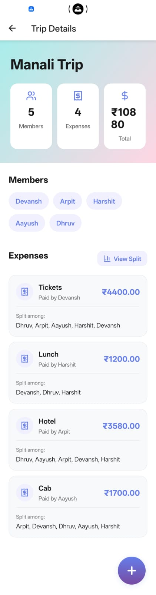
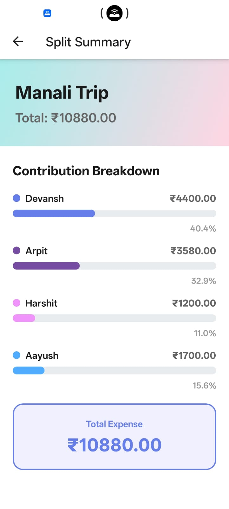
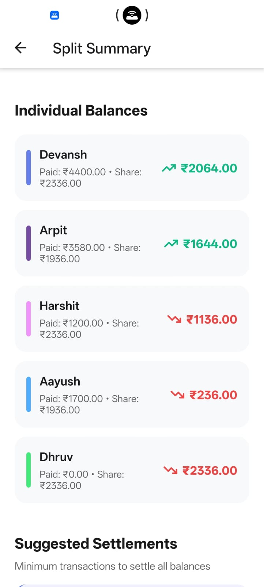
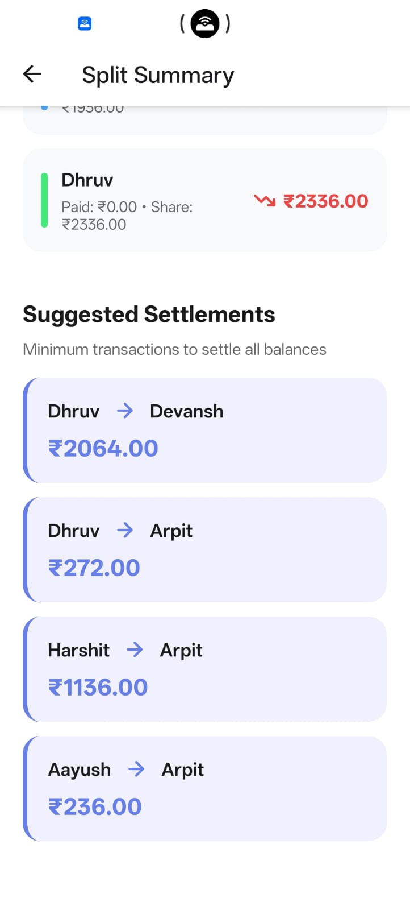

# Split Smart

A mobile application to track and split expenses among friends during group trips.  
Users can create trips, add expenses paid by different members, and view a clear summary of who owes whom.

---

## Demo

📱 Demo recorded on a physical Android device.

🎥 Video Demo: *(https://www.youtube.com/watch?v=HdNFHWKFfhA)*

### Screenshots


<h4>1. Home</h4>


<h4>2. Creating a New Trip</h4>


<h4>3. Adding Members</h4>


<h4>4. Trip Dashboard</h4>


<h4>5. Adding Expenses</h4>


<h4>6. Trip Details After All Expenses</h4>


<h4>7. Split Summary</h4>

<div style="display: flex; gap: 10px;">
  
  
  
</div>creenshot/SplitSummery3.jpeg" alt="Summary 3" width="300px">


---

## Features

- Create and manage multiple trips  
- Add participants for each trip  
- Record expenses with payer and involved members
- Partial involvements: Involve only selected members
- Full involvements: Involve everyone in the expense
- Automatically calculate individual balances  
- Clear summary of who owes and who is owed how much
- Possitive and negatives of each person
- Suggested Settlements
- Simple, Beautiful and mobile-friendly UI  

---

## Tech Stack

- **React Native**  
- **Expo**  
- **Expo Router** (file-based routing)  
- **TypeScript**  
- **React Context API** (state management)  

---

# How to Run Locally

### Prerequisites

- Node.js  
- Expo CLI  
- Expo Go app on your phone  

### Steps

```bash
git clone <repo-url>
cd <project-folder>
npm install
npx expo start
Scan the QR code using Expo Go to run the app on your device.
```
